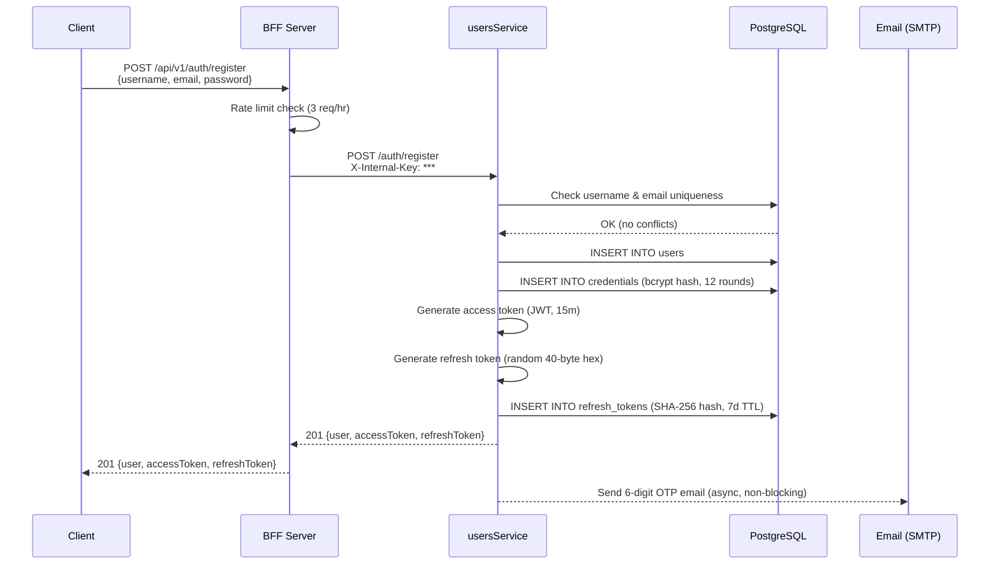
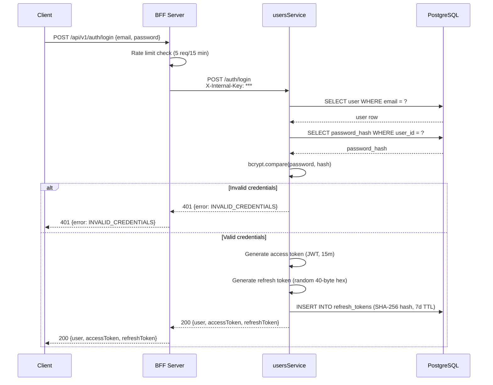
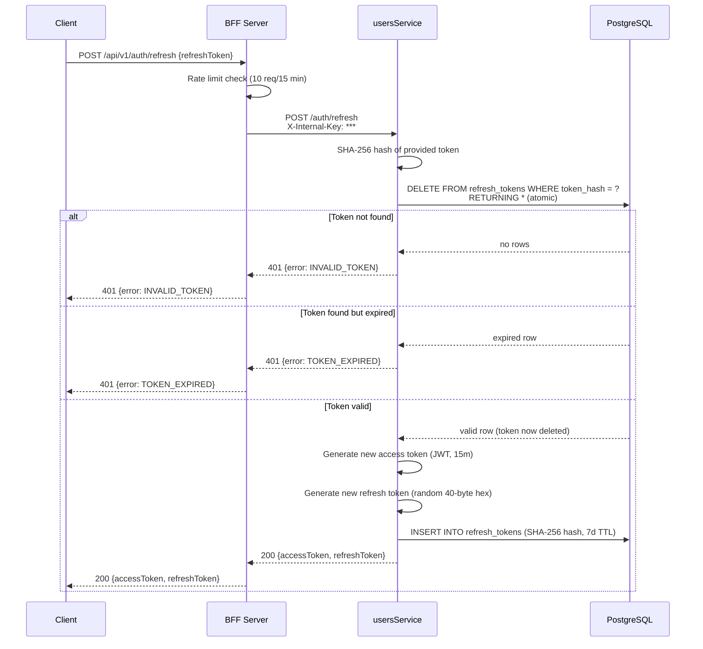
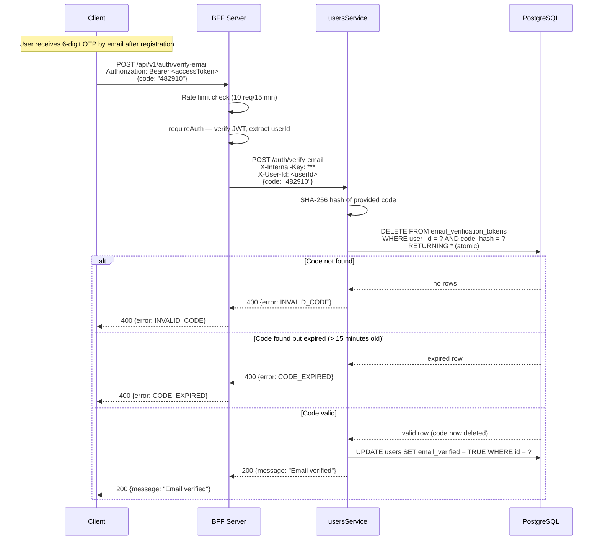
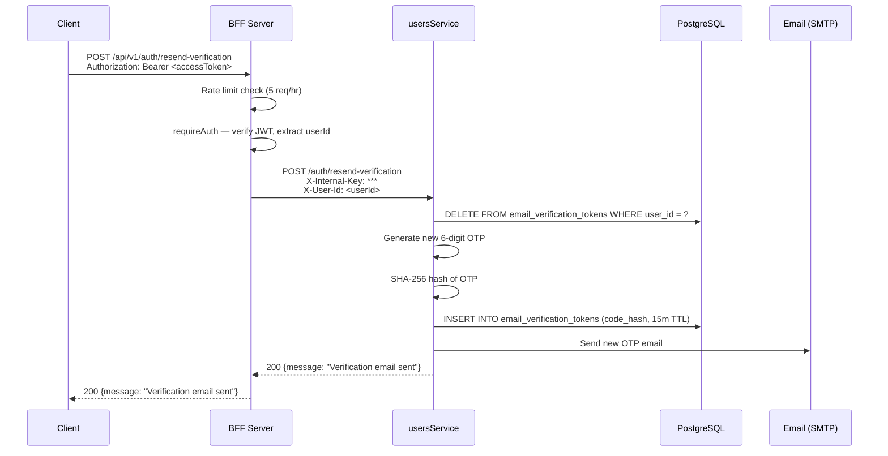
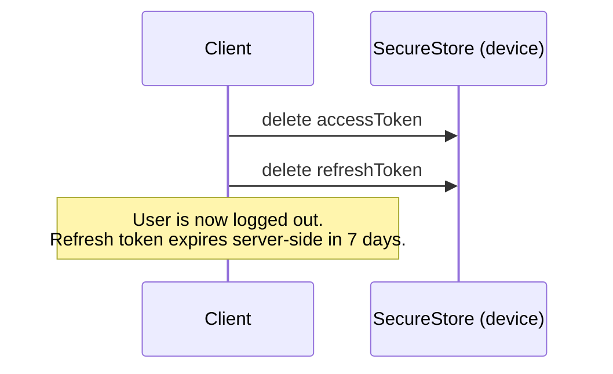

# Auth Flows — UsersService

This document describes all authentication flows supported by the Tone Chat platform. The **usersService** owns identity, credentials, and token lifecycle. The **BFF server** acts as the sole internet-facing gateway — it verifies JWTs locally, enforces rate limits, and forwards requests to usersService with internal headers.

---

## Table of Contents

1. [Architecture Overview](#architecture-overview)
2. [Registration](#registration)
3. [Login](#login)
4. [Token Refresh](#token-refresh)
5. [Email Verification](#email-verification)
6. [Resend Verification Email](#resend-verification-email)
7. [Logout](#logout)
8. [Error Codes Reference](#error-codes-reference)
9. [Rate Limits](#rate-limits)
10. [Token Storage & Security Notes](#token-storage--security-notes)

---

## Architecture Overview

```
Client ──── HTTPS ────► BFF Server (:4000)
                            │
                   X-Internal-Key header
                            │
                            ▼
                    usersService (:3002)
                            │
                            ▼
                       PostgreSQL
                      (users, credentials,
                    refresh_tokens,
               email_verification_tokens)
```

All routes require the `X-Internal-Key` header, set by the BFF (never by the client). Routes that act on behalf of a specific user also receive an `X-User-Id` header extracted from the verified JWT.

**BFF client-facing base path**: `/api/v1/auth`

---

## Registration

### Endpoint

```
POST /api/v1/auth/register
```

### Request Body

```json
{
  "username": "alice",
  "email": "alice@example.com",
  "password": "supersecret123"
}
```

| Field | Type | Constraints |
|-------|------|-------------|
| `username` | string | required, unique |
| `email` | string | required, unique, valid email |
| `password` | string | required, min 8 characters |

### Success Response — `201 Created`

```json
{
  "user": {
    "id": "550e8400-e29b-41d4-a716-446655440000",
    "username": "alice",
    "email": "alice@example.com",
    "email_verified": false,
    "display_name": null,
    "pronouns": null,
    "avatar_url": null,
    "status": "offline",
    "bio": null,
    "created_at": "2025-01-01T00:00:00.000Z",
    "updated_at": "2025-01-01T00:00:00.000Z"
  },
  "accessToken": "<JWT — expires in 15 minutes>",
  "refreshToken": "<opaque token — expires in 7 days>"
}
```

### Sequence Diagram



### Notes

- Password hashed with **bcrypt, 12 rounds** before storage. The plaintext password never persists.
- The verification email is sent **asynchronously** — a failure to send the email does not fail registration.
- In development (no `SMTP_HOST` configured), the OTP is **logged to the usersService console** instead of emailed.
- The returned `accessToken` is usable immediately; however, some features may require `email_verified: true`.

---

## Login

### Endpoint

```
POST /api/v1/auth/login
```

### Request Body

```json
{
  "email": "alice@example.com",
  "password": "supersecret123"
}
```

### Success Response — `200 OK`

```json
{
  "user": { ...same shape as registration... },
  "accessToken": "<JWT — expires in 15 minutes>",
  "refreshToken": "<opaque token — expires in 7 days>"
}
```

### Sequence Diagram



### Notes

- Uses **constant-time** bcrypt comparison to prevent timing attacks.
- On successful login, a **new** refresh token is issued and stored. Any previously issued refresh tokens remain valid until they are used or expire.

---

## Token Refresh

### Endpoint

```
POST /api/v1/auth/refresh
```

### Request Body

```json
{
  "refreshToken": "<opaque token from login or previous refresh>"
}
```

### Success Response — `200 OK`

```json
{
  "accessToken": "<new JWT — expires in 15 minutes>",
  "refreshToken": "<new opaque token — expires in 7 days>"
}
```

### Sequence Diagram



### Notes

- The old refresh token is **atomically consumed** (DELETE…RETURNING). This prevents the same token from being used twice — even under concurrent requests.
- If the same refresh token is sent twice simultaneously, only one will succeed; the other will receive `INVALID_TOKEN`.
- Clients must store the **new** refresh token immediately upon receiving the response and discard the old one.

---

## Email Verification

### Endpoint

```
POST /api/v1/auth/verify-email
Authorization: Bearer <accessToken>
```

### Request Body

```json
{
  "code": "482910"
}
```

### Success Response — `200 OK`

```json
{
  "message": "Email verified"
}
```

### Sequence Diagram



### Notes

- The OTP is a **6-digit numeric code** stored as a SHA-256 hash in the database.
- OTPs expire after **15 minutes**.
- The code is consumed on use — it cannot be reused.
- Requires a valid `accessToken` in the `Authorization` header.

---

## Resend Verification Email

### Endpoint

```
POST /api/v1/auth/resend-verification
Authorization: Bearer <accessToken>
```

### Request Body

*(empty)*

### Success Response — `200 OK`

```json
{
  "message": "Verification email sent"
}
```

### Sequence Diagram



### Notes

- Any existing pending codes for this user are deleted before issuing a new one.
- Requires a valid `accessToken` in the `Authorization` header.
- In development, the OTP is logged to the usersService console instead of emailed.

---

## Logout

There is no dedicated logout endpoint. Logout is handled client-side:

1. **Delete** the stored `accessToken` and `refreshToken` from secure storage.
2. Optionally, **do not call** `/auth/refresh` again — the refresh token will expire naturally after 7 days.



### Notes

- Access tokens are short-lived (15 minutes) and cannot be revoked server-side.
- If you need immediate invalidation (e.g., account compromise), use the token rotation property: once the stored refresh token is deleted client-side, no new access tokens can be issued.
- Future work: server-side token blacklist or `DELETE /auth/logout` endpoint that deletes the refresh token row.

---

## Error Codes Reference

All errors follow the shape:

```json
{
  "error": {
    "code": "ERROR_CODE",
    "message": "Human-readable description",
    "status": 400
  }
}
```

| Code | HTTP Status | Trigger |
|------|-------------|---------|
| `MISSING_FIELDS` | 400 | Required field(s) absent from request body |
| `PASSWORD_TOO_SHORT` | 400 | Password is fewer than 8 characters |
| `USERNAME_TAKEN` | 409 | Provided username is already registered |
| `EMAIL_TAKEN` | 409 | Provided email is already registered |
| `INVALID_CREDENTIALS` | 401 | Email not found or password does not match |
| `INVALID_TOKEN` | 401 | Refresh token not found (already used or never issued) |
| `TOKEN_EXPIRED` | 401 | Refresh token found but past its expiry date |
| `INVALID_CODE` | 400 | Email verification code not found |
| `CODE_EXPIRED` | 400 | Email verification code found but past its 15-minute window |
| `MISSING_TOKEN` | 401 | `Authorization` header missing on a protected route |
| `UNAUTHORIZED` | 401 | JWT invalid or expired on a protected route |

---

## Rate Limits

Rate limits are enforced by the BFF server using `express-rate-limit`. Exceeding the limit returns **429 Too Many Requests**.

| Endpoint | Limit |
|----------|-------|
| `POST /auth/register` | 3 requests per hour per IP |
| `POST /auth/login` | 5 requests per 15 minutes per IP |
| `POST /auth/refresh` | 10 requests per 15 minutes per IP |
| `POST /auth/verify-email` | 10 requests per 15 minutes per IP |
| `POST /auth/resend-verification` | 5 requests per hour per IP |

---

## Token Storage & Security Notes

### Client Storage

| Token | Storage | Rationale |
|-------|---------|-----------|
| `accessToken` (JWT) | Zustand in-memory + `expo-secure-store` | SecureStore uses Keychain (iOS) / Keystore (Android) |
| `refreshToken` (opaque) | `expo-secure-store` | Same secure hardware-backed storage |

### Token Properties

| Property | Access Token | Refresh Token |
|----------|-------------|---------------|
| Format | JWT (signed HS256) | Random 40-byte hex (opaque) |
| Expiry | 15 minutes | 7 days |
| Storage (server) | Stateless — not stored | SHA-256 hash in `refresh_tokens` table |
| Rotation | Issued on every login/register | Rotated on every `/auth/refresh` call |
| Revocation | Not revocable (short TTL is the mitigation) | Revoked on use (atomic DELETE) |

### Key Security Properties

- **No plaintext secrets in the database** — passwords are bcrypt-hashed, refresh tokens and OTPs are SHA-256-hashed before storage.
- **Atomic token rotation** — the `DELETE … RETURNING` pattern prevents refresh token reuse under concurrent requests.
- **Short-lived access tokens** — 15-minute TTL limits the window of exposure if a JWT is intercepted.
- **Internal network isolation** — usersService is not internet-exposed. All traffic arrives from the BFF with a shared `X-Internal-Key`.
